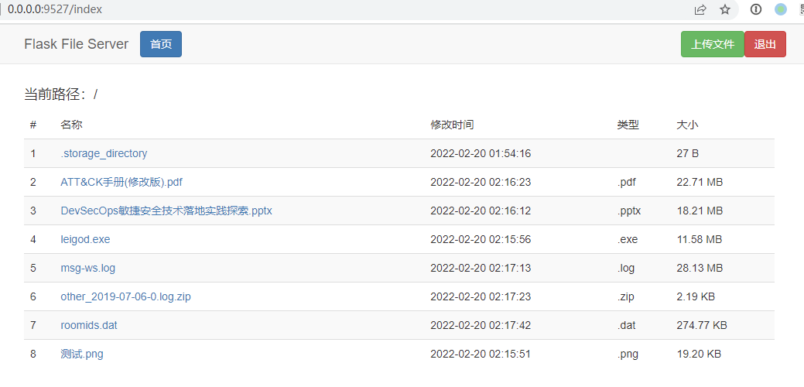

# flask-file-server

> 开箱即用的 Python Flask 文件服务

------

## 环境要求

  


## 项目介绍

使用 [Flask](https://flask.palletsprojects.com/en/2.0.x/) 框架实现的一个简单文件服务，前端使用 bootstrap 风格，支持文件上传和下载。

> 此项目仅用于学习用途，因为内在逻辑相对简单，所以存在路径穿越等安全问题没有处理，切勿用于生产环境




## 部署步骤

### 主机部署

1. 下载本仓库 `git clone https://github.com/lyy289065406/flask-file-server.git`
2. 可自行修改 [settings.yml](./app/conf/settings.yml) 中关于服务本身的环境配置
3. 本地启动： `python ./app/main.py`
4. 访问 [http://127.0.0.1:9527](http://127.0.0.1:9527)，默认账密为 `admin / 123456`


### Docker 部署

1. 下载本仓库 `git clone https://github.com/lyy289065406/flask-file-server.git`
2. 可自行修改 [docker-compose.yml](./docker-compose.yml) 中关于服务本身的环境配置
3. 本地构建镜像： `bin/build.sh` 或 `ps/build.ps1`
4. 本地运行容器： `bin/run.sh` 或 `ps/run.ps1`
5. 在 hosts 添加 `{your_IP}  flask.local.com` 域名解析
6. 访问 [http://flask.local.com](http://flask.local.com)，默认账密为 `admin / 123456`

由于 docker 运行的架构模式为 nginx -> uwsgi -> flask，所以无法通过 IP 访问（跨域问题），默认使用 `flask.local.com` 作为访问入口，需要手动为其添加 DNS 解析，解析到本地、局域网、公网均可。**若要修改你自己的域名/端口，请全局搜索并替换域名/端口。**


> 若不想下载 Github 仓库，可以直接使用 docker hub 的镜像 [expm02/flask-file-server:latest](https://hub.docker.com/repository/docker/expm02/flask-file-server#)


<details>
<summary><b>Docker 相关脚本说明</b></summary>
<br/>

- [`bin`](./bin) 目录为 linux/mac 的执行脚本
- [`ps`](./ps) 目录为 windows 的执行脚本


1. 构建镜像： `bin/build.sh` 或 `ps/build.ps1`
2. 清理镜像： `bin/clean.sh` 或 `ps/clean.ps1`
3. 发布镜像： `bin/deploy.sh` 或 `ps/deploy.ps1`
4. 运行容器： `bin/run.sh` 或 `ps/run.ps1`
5. 停止容器： `bin/stop.sh` 或 `ps/stop.ps1`

</details>


## 目录结构

```
flask-file-server
├── README.md ...................... [此说明文档]
├── Dockerfile  .................... [Docker 构建脚本]
├── docker-compose.yml ............. [Docker 构建脚本]
├── LICENSE
├── imgs
├── app ............................ [应用根目录]
│   ├── conf
│   │   └── settings.yml ........... [应用配置，关键配置项有注释]
│   ├── files ...................... [上传文件的存储位置]
│   ├── web_root ................... [web 根目录]
│   ├── settings.py ................ [应用配置加载]
│   ├── main.py .................... [应用启动入口（python 启动方式）]
│   ├── entrypoint.sh .............. [应用启动入口（docker 启动方式）]
│   ├── uwsgi.ini .................. [uwsgi 启动配置]
│   └── requirements.txt ........... [python 依赖说明]
├── bin  ........................... [linux 执行脚本]
│   ├── build.sh ................... [构建镜像]
│   ├── clean.sh ................... [清理镜像]
│   ├── deploy.sh .................. [发布镜像]
│   ├── run.sh ..................... [运行容器]
│   └── stop.sh .................... [停止容器]
└── ps  ............................ [windows 执行脚本]
    ├── build.ps1 .................. [构建镜像]
    ├── clean.ps1 .................. [清理镜像]
    ├── deploy.ps1 ................. [发布镜像]
    ├── run.ps1 .................... [运行容器]
    └── stop.ps1 ................... [停止容器]
```

## 参考文档

- 《[uWSGI - Flask 中文文档](https://dormousehole.readthedocs.io/en/latest/deploying/uwsgi.html)》
- 《[使用 uWSGI 运行 flask 项目详解](https://cloud.tencent.com/developer/article/1609621)》
- 《[在 Ubuntu 上使用 Nginx 部署 Flask 应用](https://www.oschina.net/translate/serving-flask-with-nginx-on-ubuntu)》
- 《[Django 部署时为什么要用 uWSGI与 Nginx? 以及 WSGI，uwsgi等协议](https://www.cnblogs.com/luodaxia/p/12023492.html)》
- 《[uwsgi uwsgi flask app and nginx gives 404 not found](https://stackoverflow.com/questions/70214790/uwsgi-uwsgi-flask-app-and-nginx-gives-404-not-found)》
- 《[All routes except "/" return 404 from Nginx running Flask WSGI](https://askubuntu.com/questions/1173951/all-routes-except-return-404-from-nginx-running-flask-wsgi)》
